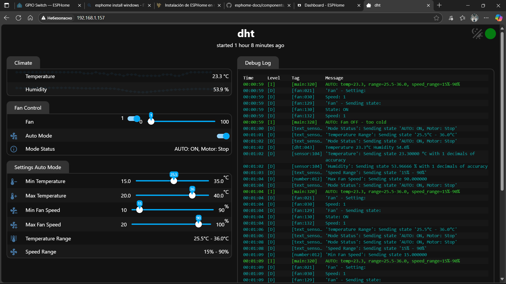

# ESPHome Smart Fan Controller

[🇺🇦 Українська версія](#esphome-розумний-контролер-вентилятора)

  
 

A smart temperature-based fan controller built with ESPHome for ESP8266/ESP32 boards. Features automatic speed control based on temperature readings and manual override capabilities.

## Features

- **Dual Control Modes**: Manual and Automatic
- **Temperature-Based Control**: Automatically adjusts fan speed based on ambient temperature
- **Configurable Parameters**: All settings adjustable via web interface
- **State Persistence**: All settings saved to flash memory and restored after power loss
- **Web Interface**: Built-in web server for control and monitoring
- **Home Assistant Integration**: Full integration with Home Assistant via ESPHome API
- **Validation**: Built-in parameter validation to prevent incorrect settings

## Hardware Requirements

- ESP8266 board (tested on Wemos D1 Mini)
- DHT22/DHT11 or DS18B20 temperature sensor
- Solid State Relay (SSR) for AC motor control
- Standard AC room/ceiling fan (NO PWM support needed)
- Power supply for ESP8266

## Pin Configuration

- **D5**: DHT/DS18B20 sensor data pin
- **D7**: Control signal for Solid State Relay (inverted signal)

## Important Hardware Notes

This controller uses **slow PWM** technique to control standard AC fans that do not have built-in speed control. The solid state relay rapidly switches the AC power on/off to achieve speed control.

**For full speed range**: Set your fan's mechanical speed switch to maximum position. The controller will then have full range control from 0-100%.

## How It Works

### Operating Modes

#### Manual Mode
- User has full control over fan speed (0-100%)
- Speed changes are saved to flash memory
- Last manual speed is restored when switching back from Auto mode

#### Automatic Mode
- Fan speed is calculated based on current temperature
- Only works when fan is turned ON by user
- Speed varies linearly between configured min/max speeds based on temperature range
- When temperature is below minimum: fan runs at 0% (technical stop)
- When temperature is above maximum: fan runs at configured maximum speed

### Algorithm Details

The automatic control uses a linear interpolation algorithm:

1. **Temperature below min_temp**: Fan speed = 0%
2. **Temperature above max_temp**: Fan speed = max_speed
3. **Temperature in range**: 
   ```
   temp_ratio = (current_temp - min_temp) / (max_temp - min_temp)
   fan_speed = min_speed + temp_ratio * (max_speed - min_speed)
   ```

### PWM Control Configuration

The `period` parameter in the `slow_pwm` output (currently set to 2500ms) is crucial for proper fan operation. This controller uses **slow PWM** to control standard AC motors by rapidly switching power through a Solid State Relay.

This value depends on:

- **Fan motor inertia**: Larger fans need longer periods to maintain smooth operation
- **Motor power**: More powerful motors can handle shorter switching periods
- **Blade size and weight**: Heavier blades require longer periods to avoid flickering
- **AC frequency**: 50Hz or 60Hz mains frequency affects optimal switching time

**Why not make it configurable via UI?**
The PWM period is a hardware-specific parameter that:
- Requires restart to change
- Can cause motor overheating or relay damage if set incorrectly
- Needs to be tested for each specific fan/motor combination
- Is typically set once during initial setup
- Too short periods can cause annoying acoustic noise or motor vibration

For your specific fan, you may need to adjust this value in the YAML configuration and test different values between 1000ms and 5000ms. Start with longer periods and gradually decrease until you find the optimal balance between smooth operation and good speed control.

## Configuration Parameters

### Temperature Settings
- **Min Temperature** (15-35°C): Below this temperature, fan runs at 0%
- **Max Temperature** (20-40°C): Above this temperature, fan runs at max speed

### Speed Settings
- **Min Fan Speed** (10-90%): Minimum speed when in temperature range
- **Max Fan Speed** (20-100%): Maximum speed for automatic mode

### Validation Rules
- Min temperature cannot exceed max temperature
- Min speed cannot exceed max speed
- Invalid values are automatically corrected

## Installation

1. Clone this repository
2. Copy `secrets.yaml.example` to `secrets.yaml` and fill in your credentials
3. Adjust the configuration in `XXX-autofan.yaml` if needed
4. Flash to your ESP8266:
   ```bash
   esphome run XXX-autofan.yaml
   ```

## Web Interface

Access the built-in web interface at `http://<device-ip>` (default credentials: admin/12345678)

The interface is organized into three sections:
- **Climate**: Temperature and humidity readings
- **Fan Control**: ON/OFF control, speed adjustment, and mode selection
- **Settings Auto Mode**: Configuration parameters for automatic mode

## Home Assistant Integration

The device will automatically appear in Home Assistant if you have the ESPHome integration installed. All controls and sensors will be available as entities.

## Safety Notes

- The automatic mode will never turn the fan completely OFF - only the user can do this
- All settings are validated to prevent damage
- PWM frequency is set conservatively to work with most fans

## License

This project is licensed under the MIT License - see the LICENSE file for details.

## Contributing

Pull requests are welcome. For major changes, please open an issue first to discuss what you would like to change.

---

# ESPHome Розумний Контролер Вентилятора

Розумний контролер вентилятора з керуванням на основі температури, створений на базі ESPHome для плат ESP8266/ESP32. Має автоматичне регулювання швидкості на основі показань температури та можливість ручного керування.

## Особливості

- **Два режими керування**: Ручний та Автоматичний
- **Контроль за температурою**: Автоматично регулює швидкість вентилятора на основі температури навколишнього середовища
- **Налаштовувані параметри**: Всі налаштування доступні через веб-інтерфейс
- **Збереження стану**: Всі налаштування зберігаються у флеш-пам'яті та відновлюються після втрати живлення
- **Веб-інтерфейс**: Вбудований веб-сервер для керування та моніторингу
- **Інтеграція з Home Assistant**: Повна інтеграція з Home Assistant через ESPHome API
- **Валідація**: Вбудована перевірка параметрів для запобігання некоректним налаштуванням

## Апаратні вимоги

- Плата ESP8266 (протестовано на Wemos D1 Mini)
- Датчик температури DHT22/DHT11, або DS18B20
- Твердотільне реле (SSR) для керування двигуном змінного струму
- Стандартний кімнатний/стельовий вентилятор змінного струму (НЕ потребує підтримки PWM)
- Блок живлення для ESP8266

## Конфігурація пінів

- **D5**: Пін даних датчика DHT чи DS18B20
- **D7**: Сигнал керування для твердотільного реле (інвертований сигнал)

## Важливі примітки щодо обладнання

Цей контролер використовує техніку **повільного PWM** для керування стандартними вентиляторами змінного струму, які не мають вбудованого регулювання швидкості. Твердотільне реле швидко вмикає/вимикає живлення змінного струму для досягнення контролю швидкості.

**Для повного діапазону швидкостей**: Встановіть механічний перемикач швидкості вашого вентилятора в положення максимальної швидкості. Контролер матиме повний діапазон керування від 0 до 100%.

## Як це працює

### Режими роботи

#### Ручний режим
- Користувач має повний контроль над швидкістю вентилятора (0-100%)
- Зміни швидкості зберігаються у флеш-пам'яті
- Остання ручна швидкість відновлюється при поверненні з автоматичного режиму

#### Автоматичний режим
- Швидкість вентилятора розраховується на основі поточної температури
- Працює тільки коли вентилятор увімкнений користувачем
- Швидкість змінюється лінійно між налаштованими мін/макс швидкостями на основі діапазону температур
- Коли температура нижче мінімальної: вентилятор працює на 0% (технічна зупинка)
- Коли температура вище максимальної: вентилятор працює на налаштованій максимальній швидкості

### Деталі алгоритму

Автоматичне керування використовує алгоритм лінійної інтерполяції:

1. **Температура нижче min_temp**: Швидкість вентилятора = 0%
2. **Температура вище max_temp**: Швидкість вентилятора = max_speed
3. **Температура в діапазоні**: 
   ```
   temp_ratio = (поточна_темп - min_temp) / (max_temp - min_temp)
   швидкість_вентилятора = min_speed + temp_ratio * (max_speed - min_speed)
   ```

### Налаштування PWM керування

Параметр `period` у виході `slow_pwm` (зараз встановлено 2500мс) є критичним для правильної роботи вентилятора. Цей контролер використовує **повільний PWM** для керування стандартними двигунами змінного струму шляхом швидкого перемикання живлення через твердотільне реле.

Це значення залежить від:

- **Інерції двигуна вентилятора**: Більші вентилятори потребують довших періодів для плавної роботи
- **Потужності двигуна**: Потужніші двигуни можуть працювати з коротшими періодами перемикання
- **Розміру та ваги лопатей**: Важчі лопаті вимагають довших періодів для уникнення мерехтіння
- **Частоти мережі**: 50Гц або 60Гц частота мережі впливає на оптимальний час перемикання

**Чому не можна зробити це налаштування через інтерфейс?**
Період PWM - це апаратно-специфічний параметр, який:
- Вимагає перезавантаження для зміни
- Може спричинити перегрів двигуна або пошкодження реле при неправильному налаштуванні
- Потребує тестування для кожної конкретної комбінації вентилятор/двигун
- Зазвичай встановлюється один раз під час початкового налаштування
- Занадто короткі періоди можуть спричинити дратівливий акустичний шум або вібрацію двигуна

Для вашого конкретного вентилятора може знадобитися налаштувати це значення в YAML конфігурації та протестувати різні значення між 1000мс та 5000мс. Починайте з довших періодів і поступово зменшуйте, поки не знайдете оптимальний баланс між плавною роботою та хорошим контролем швидкості.

## Встановлення
1. Клонуйте цей репозиторій
2. Скопіюйте `secrets.yaml.example` в `secrets.yaml` та заповніть ваші дані
3. Налаштуйте конфігурацію в `XXX-autofan.yaml` за потреби
4. Прошийте на ваш ESP8266:
   ```bash
   esphome run XXX-autofan.yaml
   ```

## Веб-інтерфейс
Доступ до вбудованого веб-інтерфейсу за адресою `http://<ip-пристрою>` (дані для входу за замовчуванням: admin/12345678)

Інтерфейс організований у три секції:
- **Climate**: Показники температури та вологості
- **Fan Control**: Керування увімкнення/вимкнення, регулювання швидкості та вибір режиму
- **Settings Auto Mode**: Параметри конфігурації для автоматичного режиму

## Інтеграція з Home Assistant
Пристрій автоматично з'явиться в Home Assistant, якщо у вас встановлена інтеграція ESPHome. Всі елементи керування та сенсори будуть доступні як сутності.

## Примітки з безпеки
- Автоматичний режим ніколи не вимкне вентилятор повністю - це може зробити тільки користувач
- Всі налаштування перевіряються для запобігання пошкодженням
- Частота PWM встановлена консервативно для роботи з більшістю вентиляторів

## Ліцензія
Цей проект ліцензований під ліцензією MIT - дивіться файл LICENSE для деталей.

## Внесок у проект
Pull request'и вітаються. Для значних змін, будь ласка, спочатку відкрийте issue для обговорення того, що ви хотіли б змінити.
